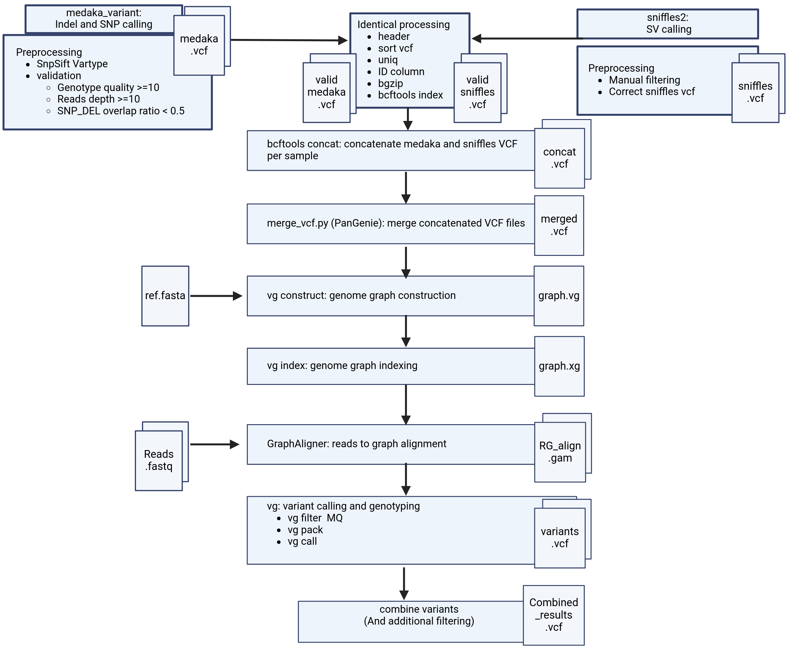

# ToxoVar
This repository contains a Snakemake pipeline for the comparative analysis of three isolates from three clones of T. gondii ME49, which have been obtained and maintained under different culture conditions. The pipeline is designed to analyze genomic variations and perform pairwise comparisons.

Key features and processes of the pipeline include:

    Calling SNPs and indels using Medaka.
    Detecting structural variations (SVs) with Sniffles.
    Integrating called variations for all isolates into a variation graph constructed by VG.
    Aligning reads to the graph for each sample independently.
    Outputting a set of high-quality variants for each sample.

The goal is to provide a comprehensive framework for understanding the genetic diversity and evolutionary dynamics of T. gondii isolates, leveraging the power of graph genomes and long-read sequencing data to uncover detailed insights into genomic variations.
## Resources

The `resources/` directory contains essential reference files required by the pipeline:

- `2015T_assembly.fa`: A high-quality genome assembly of the *T. gondii* ME49 2015T isolate. (variants are called against it.)
- `annotation.gff3.gz`: Genome annotation file generated using **Companion**
- `homo.bed`: Genomic positions of **homopolymeric regions**
- `TR.bed`: Genomic positions of **tandem repeats (TRs)**
- `numts.bed`: Genomic positions of **nuclear mitochondrial DNA segments (NUMTs)**
- `positions_to_mask_variants_in.bed`: Genomic positions that expected to contain false positive variant calls

These BED files are used for variant filtering and quality control steps within the workflow.

# Dependencies
    Medaka 1.11.3:
    Sniffles 2.2:  
    Ensemble_vep: 
    SnpEff:       
    GraphAligner:  
    
---
# Pipeline Overview



### Usage
To utilize the pipeline, users need to modify the `config.yaml` file located in the config directory. This modification includes specifying the directory path to the FASTQ files in `samples:`. It is crucial that the sample name in the `config.yaml` file matches other entries in `pileup:` and `models:`. Additionally, the paths to the reference, GFF and BED files should also be included in the config file. For information about each entry in the config.yaml file, a sample file (config_sample.yaml) is provided in the config/ directory

#### To Call SNPs and Indels
Execute the following command:
```bash
snakemake --profile profiles/ call_small_variations
```
The final output for this step is a VCF file named medaka.annotated_with_VarType_valid.newHead.sorted.assignedID.vcf for each sample. It will be located in a subdirectory named medaka_<sample_name> within the specified output directory.

#### To Call Structural Variations (SVs)
Use this command:
```bash
snakemake --profile profiles/ call_SVs
```

The final output of this step consists of two VCF files per sample:
- `sniffles_<sample>_with_reference_corrected.vcf`: the raw VCF file after reference correction.
- `sniffles_<sample>_with_reference_corrected.newHead_assignedID_sorted.vcf.gz`: the processed and sorted version used in downstream analysis.

If manual filtering is necessary, the user should create a filtered VCF file using the same format as `sniffles_<sample>_with_reference_corrected.vcf`. This can be done by copying the content of the original file and removing the variants that should be excluded. All header and data fields must be preserved to maintain compatibility with the pipeline.

#### Graph genotyping
Use this command:
```bash
snakemake --profile profiles/ Graph
```
In the graph-based genotyping step, the final Medaka VCF files are further filtered using structural variant (SV) information—either automatically generated or manually curated SVs if provided—as well as genomic regions defined in BED files (see `config.yaml` for details). These filtered small variants and SVs are integrated into a variation graph, which is then used to genotype all samples. The final per-sample genotyping results are located in `Graph/graph_construction/<sample>_graph_Alignment/<sample>_variants_MQ30_BQ20_vartype_total_filtered.vcf` within the specified output directory. Additionally, all genotypes (before and after graph-based filtering) are merged into a single file: `Graph/graph_construction/results/merged_vg_combined_table_placed_ref_for_igv.vcf`, which is used for downstream analysis.

#### Startify variants by genomic location and predict effect 
Use this command:
```bash
snakemake --profile profiles/ vcf_analysis
```
The output of the graph step can be further filtered manually by the user. If manual filtering is performed, the path to the modified VCF file must be specified in the `config.yaml` file. This VCF will then be stratified by regions overlapping NUMTs, homopolymers, or tandem repeats, with each category written to a separate VCF file. Additionally, variant effect prediction will be performed on the final VCF using Ensembl VEP.


    

